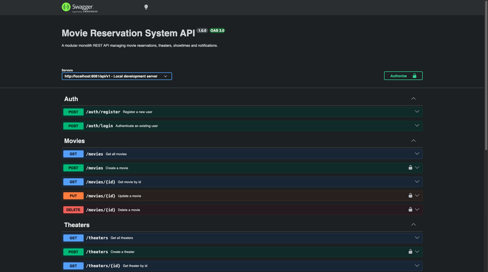

# 🎬 Movie Reservation System

A production-ready modular monolith REST API for managing movie reservations, built with Node.js, MongoDB, RabbitMQ, and Redis.

---

## Architecture

The system is split into two standalone services:

- **api-server** — core monolith handling all business domains
- **notification** — independent email notification service

Client
└── api-server (port 8081)
├── Auth
├── Movies
├── Theaters (auto-generates seats)
├── Showtimes
└── Reservations
└── RabbitMQ Pipeline
├── reservation_created → confirms reservation in DB
├── reservation_confirmed → triggers notification
├── reservation_notified → marks pipeline complete
└── reservation_cancelled → triggers cancellation email
notification (port 8080)
└── Listens on notification_send queue → sends email via Brevo

---

## Tech Stack

| Layer | Technology |
|---|---|
| Runtime | Node.js v26 |
| Framework | Express.js v5 |
| Database | MongoDB + Mongoose |
| Message Broker | RabbitMQ |
| Cache / State | Redis (ioredis) |
| Email | Brevo (Sendinblue) |
| Auth | JWT |
| Docs | Swagger UI |
| Container | Docker + Docker Compose |

---

## Modules

| Module | Description |
|---|---|
| Users | Registration, login, JWT auth, role-based access |
| Movies | CRUD, pagination, availability |
| Theaters | CRUD, auto seat generation on create, cascade delete |
| Seats | Auto-generated per theater, VIP/regular, status tracking |
| Showtimes | CRUD, overlap detection, VIP/regular pricing |
| Reservations | Full booking pipeline, cancellation, email notification |

---

## Getting Started

### Prerequisites
- Docker + Docker Compose

###  Clone the repo
```bash
git clone https://github.com/git-o3/movie-reservation-system.git
cd movie-reservation-system
```

###  Configure environment variables

**api-server:**
```bash
cp api-server/.env.example api-server/.env
```

Fill in:

MONGO_URI=mongodb://mongo_db:27017/movie_reservation
PORT=8081
NODE_ENV=development
JWT_SECRET=your_jwt_secret
MESSAGE_BROKER_URL=amqp://rabbit_mq:5672
REDIS_HOST=redis_db
REDIS_PORT=6379

**notification:**
```bash
cp notification/.env.example notification/.env
```

Fill in:

PORT=8080
NODE_ENV=development
MESSAGE_BROKER_URL=amqp://rabbit_mq:5672
REDIS_HOST=redis_db
REDIS_PORT=6379
BREVO_API_KEY=your_brevo_api_key
BREVO_SENDER_EMAIL=your_verified_brevo_email
BREVO_SENDER_NAME=Movie Reservation

###  Start the system
```bash
docker-compose up --build
```

###  Initialize MongoDB replica set
```bash
docker exec -it mongo_db mongosh --eval "rs.initiate()"
```

###  Access the API

http://localhost:8081/api/v1

###  API Documentation

http://localhost:8081/api/v1/docs

---

## Authentication



All protected routes require a JWT Bearer token.

1. Register → `POST /api/v1/auth/register`
2. Login → `POST /api/v1/auth/login`
3. Copy the token from the response
4. Add to request headers: `Authorization: Bearer <token>`

Admin routes additionally require `role: admin`. Promote a user via:
```bash
docker exec -it mongo_db mongosh
use movie_reservation
db.users.updateOne({ email: "your@email.com" }, { $set: { role: "admin" } })
```

---

## Reservation Pipeline

POST /reservations
→ Seat locked
→ Reservation created (pending)
→ Job state written to Redis
→ Published to reservation_created queue
reservation_created consumer
→ Updates reservation to confirmed in DB
→ Published to reservation_confirmed queue
reservation_confirmed consumer
→ Publishes to notification_send queue
→ Published to reservation_notified queue
notification service
→ Picks up notification_send
→ Sends confirmation email via Brevo
reservation_notified consumer
→ Marks job complete in Redis

---

---

## License
ISC

[Project Reference](https://roadmap.sh/projects/movie-reservation-system)